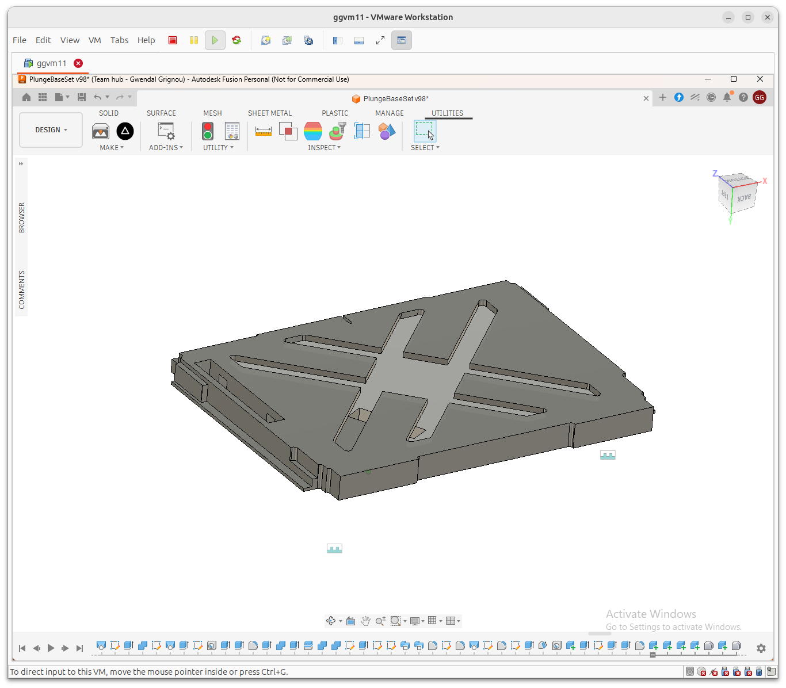
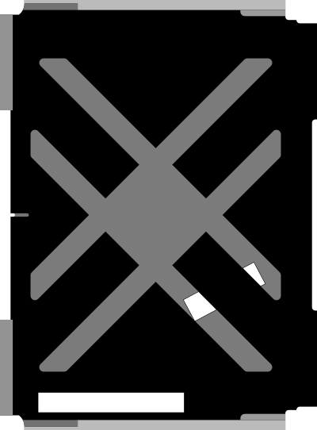
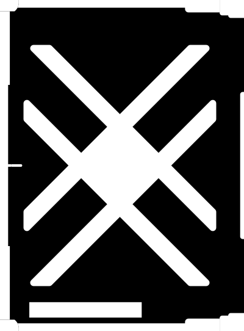
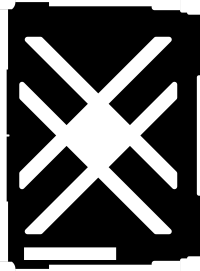
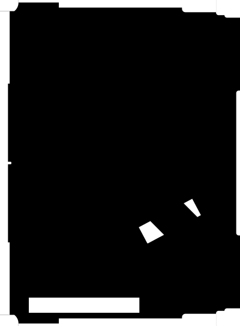
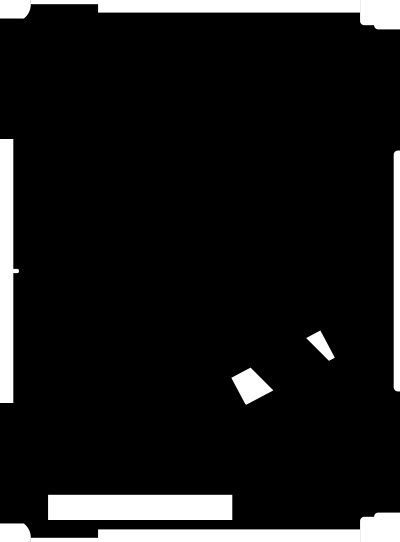
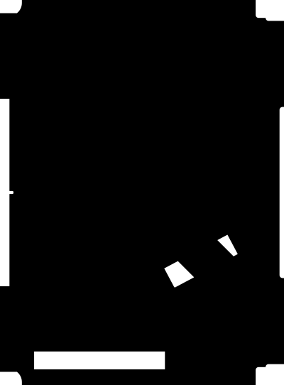

# SVG Depth Processor for CNC

This script processes SVG files exported from tools like Fusion 360 with the Shaper Origin Add-In to generate layered cut files based on depth.

## Features

- **Depth Grouping**: Generates a separate SVG for every unique `shaper:cutDepth` value found in the input.
- **Incremental Merging**: For each target depth, it includes all shapes that are **at that depth or deeper**.
- **Attribute Cleanup**:
    - Sets all non-black paths to **white fill** (`rgb(255, 255, 255)`).
    - Removes `stroke`, `stroke-width`, and `fill-rule` from white paths to ensure clean pocketing/clearing operations.
    - Preserves **black paths** (typically used for guide lines or special cuts) with their original attributes.
- **Path Merging**: Automatically combines paths with identical styles and transformations into single **compound paths**, optimizing the file for machine performance.
- **Uniform Depth Assignment**: All shapes in a generated output file are assigned the exact same `shaper:cutDepth` value.
- **Safe Filenames**: Replaces dots in depth values with dashes (e.g., `5.08cm` -> `5-08cm`) to preserve sorting order and file system compatibility.

## Visual Overview

### 1. Input SVG
For instance, let's consider the following desgin: 
The generated SVG  contains paths with the `shaper:cutDepth` attribute.

### 2. Processing
Shapes are filtered, attributes cleaned, and paths merged.

### 3. Output SVGs
One file per depth, containing all shapes intended to be cut at or below that level:
- 4mm layer: 
- 6mm layer: 
- 12mm layer: 
- 22mm layer: 
- ~1in layer: 

## Requirements

- Python 3
- `lxml` library

Install dependencies:
```bash
pip install lxml
```

## Usage

Run the script by passing the path to your source SVG filem it will generate the files in the same directory.

```bash
python3 process_svg.py my_layout.svg
```

### Example
If `my_layout.svg` has shapes at `2mm`, `4mm`, and `6mm`:
- `my_layout_2mm.svg`: Contains all shapes (2mm, 4mm, 6mm), all set to 2mm depth.
- `my_layout_4mm.svg`: Contains 4mm and 6mm shapes, all set to 4mm depth.
- `my_layout_6mm.svg`: Contains only 6mm shapes, set to 6mm depth.

## License
MIT
